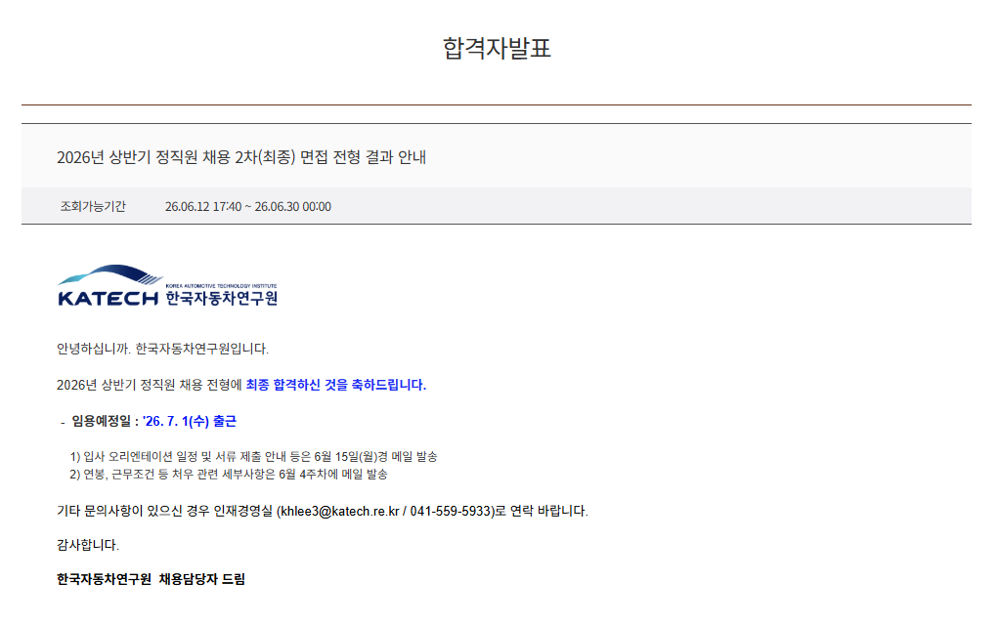

# 이태연 포트폴리오
지원자 포트폴리오

## 소개

전력전자 및 무선전력전송 연구개발 엔지니어

---

## 연구분야
<!-- -->
- Wireless Power Transfer
- Power Electronics
- Motor Drive
- EV Charging
- International Standardization

---

## 주요 프로젝트

### EV 무선충전 시스템 개발

- 역할 : 제어기 설계
- 사용기술 : MATLAB, Simulink

### IEC 국제표준화 활동

- TC 참여
- 기술 검토 및 표준 제안

---

## 논문

1. IEEE Transactions ...
2. Applied Energy ...

---

## 특허

1. 무선충전 제어방법
2. 전력변환장치

